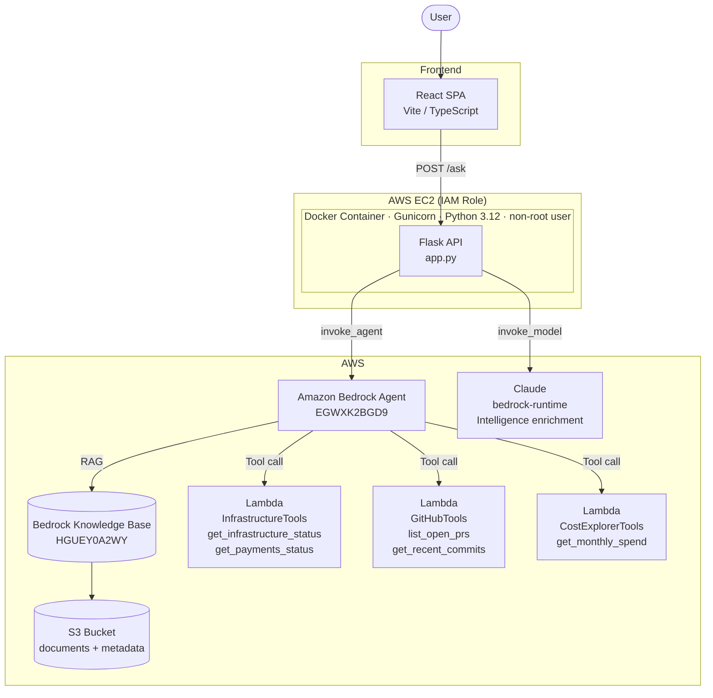

# Engineering Memory Assistant

An AI-powered knowledge retrieval system for engineering teams. Ask questions in natural language and get grounded answers from architecture decisions, incident postmortems, runbooks, and live system status — all in one place.

Built with Amazon Bedrock Agents, Flask, and React.

---

## Project Overview

Engineering teams accumulate institutional knowledge in scattered documents: ADRs, postmortems, Jira tickets, Slack threads, runbooks. When engineers leave or teams grow, that knowledge is lost. This project centralises it into a queryable assistant.

The system routes each question to the right data source automatically:

- **Historical questions** → Amazon Bedrock Knowledge Base (RAG over 57 markdown documents)
- **Live system status** → Bedrock Agent action groups backed by AWS Lambda (Payments service, infrastructure metrics)
- **Repository context** → GitHub API action group (open PRs, recent commits, branch status)
- **Cloud cost questions** → AWS Cost Explorer action group (monthly spend, service breakdown)

---

## Architecture



### Request flow

1. User submits a question (with optional team workspace filter).
2. Flask calls `bedrock-agent-runtime` → `invoke_agent`.
3. The agent scores the question semantically and selects a data source:
   - Knowledge Base for historical/architectural questions
   - An action group Lambda for live data requests
4. The agent streams its response back as an EventStream.
5. Flask runs two parallel tasks:
   - Fetch S3 header metadata for cited documents
   - Call Claude (`bedrock-runtime`) for intelligence enrichment: confidence score, documentation gap detection, freshness scoring
6. If confidence is low, a documentation gap exists, or content is stale, the owner card is surfaced from `owners.json`.
7. The enriched response is returned to the frontend.

---

## Features

### Chat Interface
- **Multi-chat sidebar** — create, rename, and delete named conversations; each chat persists independently in `localStorage` via Zustand
- **Auto-naming** — chats are named from the first question (48-character truncation)
- **Team workspace selector** — scope retrieval to Platform, Payments, Data, or DevOps; all-teams search is the default
- **Progressive loading states** — three-phase indicator: *Searching knowledge base* → *Analysing documents* → *Generating answer*
- **Suggested questions** on the landing page — six example prompts that navigate to `/chat?q=...` and auto-submit
- **Recent conversations** on the landing page — up to five most recent chats with relative timestamps

### Knowledge Retrieval
- **RAG answers** with cited source documents (filename, excerpt, author, team, last-updated date)
- **Team-scoped retrieval** — `sessionState.knowledgeBaseConfigurations` injects a metadata filter per invocation so only documents tagged for the selected team are retrieved
- **Live tool calling** — the agent invokes Lambda action groups for real-time data that is not in documents

### Intelligence Enrichment
After every answer, a second Claude call produces:
- **Confidence score** (0–100): how completely the sources answered the question
- **Documentation gap detection**: flags missing topics and records them in `knowledge_gaps.json`
- **Freshness score**: based on document dates; marks stale content
- **Owner escalation**: surfaces the right engineer when confidence < 70, a gap exists, or content is stale

### Ingestion
`ingest.py` uploads markdown documents from `knowledge_base/` to S3 with companion Bedrock metadata files (team tag, doc type), then optionally triggers a KB sync.

---

## Technologies Used

| Layer | Technology |
|---|---|
| Frontend | React 18, TypeScript, Vite, Tailwind CSS, Framer Motion |
| State management | Zustand (with `persist` middleware) |
| UI components | Radix UI, shadcn/ui, Lucide icons |
| Markdown rendering | react-markdown + remark-gfm |
| Backend | Python 3.12, Flask 3.1, Gunicorn |
| AWS SDK | boto3 1.38 |
| Containerisation | Docker (multi-stage, non-root user) |

---

## AWS Services

| Service | Purpose |
|---|---|
| **Amazon Bedrock Agent** | Orchestrates tool selection: routes questions to KB or action group Lambdas |
| **Amazon Bedrock Knowledge Base** | Vector store backed by OpenSearch Serverless; stores and retrieves document chunks |
| **Amazon S3** | Source document storage; Bedrock reads from here during KB sync |
| **AWS Lambda** | Backs each action group (InfrastructureTools, GitHubTools, CostExplorerTools) |
| **Amazon Bedrock (bedrock-runtime)** | Second Claude invocation for intelligence enrichment |
| **AWS EC2** | Hosts the Dockerised Flask application |

---

## Knowledge Base

57 markdown documents across eight categories, all stored in `knowledge_base/`:

| Category | Documents |
|---|---|
| Architecture | System architecture, multi-region failover |
| ADRs | EKS migration, Redis adoption, Karpenter autoscaler |
| Platform | Kubernetes deployment, Redis failover, service mesh, API gateway, SLO policy, secrets management, capacity planning, load balancer, onboarding |
| Payments | Payment service architecture, Stripe integration, fraud detection, PCI-DSS checklist, retry strategy, webhook processing, refunds, reconciliation, chargebacks, currency conversion |
| Data | Data warehouse, ETL pipeline, feature store, ML model training, real-time streaming, analytics dashboard, data catalogue, governance, quality, retention |
| DevOps | CI/CD pipeline, blue-green deployment, incident response, monitoring/alerting, log aggregation, disaster recovery, deployment rollback, Terraform, container security, cost optimisation |
| Incidents | Payment outage postmortem (Nov 2025), storage cost spike postmortem (Q1 2026) |
| Retrospectives / JIRA / Slack / Reviews / Reports | EKS migration retrospective, JIRA tickets, Slack discussions, security review, monthly SLO report |

Documents include structured frontmatter (author, team, last-updated, tags) parsed at query time for source attribution.

---

## Tool Calling

The Bedrock Agent uses action groups to answer questions that require live data. The Flask application calls `invoke_agent` — the agent decides which tool to use based on the question semantics.

### How routing works

The agent instructions define hard routing rules. Questions about current system status, open pull requests, or cloud costs are steered to the appropriate action group Lambda instead of the Knowledge Base.

### Action groups

**InfrastructureTools**
- `get_payments_status` — returns live Payments service health (pod count, p99 latency, incident count)
- `get_infrastructure_status` — returns Redis and core infrastructure metrics (memory usage, cache hit rate, failover state)

**GitHubTools**
- `list_open_prs` — lists open pull requests for a given repository
- `get_recent_commits` — returns recent commit history and branch status

**CostExplorerTools**
- `get_monthly_spend` — queries AWS Cost Explorer for month-to-date spend broken down by service

### Difference between KB, GitHub, and Cost Explorer

| | Knowledge Base | GitHub Tool | Cost Explorer Tool |
|---|---|---|---|
| **Data source** | Static markdown documents indexed in a vector store | Live GitHub API (via Lambda) | Live AWS Cost Explorer API (via Lambda) |
| **Answer type** | Historical context, architectural decisions, postmortems | Current repository state: PRs, commits, branches | Current cloud spend: costs, trends, service breakdown |
| **Example question** | *"Why did we migrate from ECS to EKS?"* | *"What PRs are open on the payments service?"* | *"How much are we spending on S3 this month?"* |
| **Freshness** | As current as the last KB sync | Real-time | Real-time (AWS billing data) |

---

## Local Development

### Prerequisites

- Python 3.12+
- Node.js 20+
- AWS credentials with permissions for Bedrock and S3
- Bedrock Agent (`EGWXK2BGD9`) deployed in `us-east-1`

### Backend

```bash
cd app
cp .env.example .env
# Fill in AWS_REGION, KNOWLEDGE_BASE_ID, BEDROCK_AGENT_ID, BEDROCK_AGENT_ALIAS_ID
pip install -r requirements.txt
python app.py
# → Flask running on http://localhost:5001
```

### Frontend

```bash
cd frontend
npm install
npm run dev
# → Vite dev server on http://localhost:5173
```

The frontend dev server proxies `/ask`, `/explain`, `/gaps`, and `/teams` to `http://localhost:5001`.

### Ingesting documents

```bash
cd app
python ingest.py --sync          # upload all documents and trigger KB sync
python ingest.py --dry-run       # preview what would be uploaded
python ingest.py --team Payments # upload only Payments team documents
```

### Environment variables

| Variable | Description |
|---|---|
| `AWS_REGION` | AWS region (default: `us-east-1`) |
| `KNOWLEDGE_BASE_ID` | Bedrock Knowledge Base ID |
| `BEDROCK_AGENT_ID` | Bedrock Agent ID |
| `BEDROCK_AGENT_ALIAS_ID` | Agent alias (`TSTALIASID` for draft; create a named alias for production) |
| `MODEL_ARN` | Cross-region inference profile ARN for the enrichment Claude call |
| `S3_BUCKET` | S3 bucket backing the Knowledge Base |
| `S3_PREFIX` | Key prefix within the bucket (default: `knowledge_base`) |
| `FLASK_DEBUG` | Set to `true` for development only |

---

## Deployment

The application is containerised and deployed on AWS EC2.

### Build and push

```bash
cd app
docker build -t engineering-memory-assistant .
docker tag engineering-memory-assistant <registry>/engineering-memory-assistant:latest
docker push <registry>/engineering-memory-assistant:latest
```

### Run on EC2

```bash
docker run -d \
  -p 5000:5000 \
  -e AWS_REGION=us-east-1 \
  -e KNOWLEDGE_BASE_ID=HGUEY0A2WY \
  -e BEDROCK_AGENT_ID=EGWXK2BGD9 \
  -e BEDROCK_AGENT_ALIAS_ID=TSTALIASID \
  -e MODEL_ARN=<inference-profile-arn> \
  engineering-memory-assistant
```

The EC2 instance uses an IAM instance role for AWS credentials — no keys are baked into the image.

The Dockerfile:
- Uses a two-stage build (dependency compilation → slim runtime image)
- Runs as a non-root user
- Serves with Gunicorn (4 workers, 120s timeout)
- Includes a `/health` healthcheck

The built frontend (`npm run build`) is served as static files from `app/static/dist/` by the Flask catch-all route.

---

## Example Questions

| Question | Routing |
|---|---|
| *Why did we migrate from ECS to EKS?* | Knowledge Base → ADR-001, migration log, retrospective |
| *What caused the November 2025 payment outage?* | Knowledge Base → payment-outage-postmortem |
| *What is the current status of the Payments Service?* | Agent tool → `get_payments_status` Lambda |
| *What is the current Redis failover status?* | Agent tool → `get_infrastructure_status` Lambda |
| *What are the open PRs on the payments service?* | Agent tool → `list_open_prs` Lambda |
| *How much are we spending on S3 this month?* | Agent tool → `get_monthly_spend` Lambda |
| *How does the fraud detection pipeline work?* | Knowledge Base → fraud-detection-integration |
| *What are the on-call escalation steps?* | Knowledge Base → incident-response-process, payment-service-runbook |
| *Why was Redis chosen over Memcached?* | Knowledge Base → ADR-002, Slack discussion |
| *What SLOs does the payment service have?* | Knowledge Base → payment-service-runbook, monthly SLO report |

---

## Future Improvements

- **Named agent aliases** — promote from `TSTALIASID` to a versioned production alias with rollback capability
- **Bedrock Agent memory** — enable multi-turn sessions so follow-up questions retain conversation context
- **Document freshness alerts** — proactively notify document owners when `freshness_score` drops below threshold
- **Knowledge gap dashboard** — surface `knowledge_gaps.json` entries to technical writers via the UI
- **Audience adaptation** — expose the `/explain` endpoint in the chat UI (intern / junior / senior / manager modes are already implemented in the backend)
- **CI/CD pipeline** — automate `ingest.py` on merge to `main` so the Knowledge Base stays in sync with the repository

---

## Author

**Dan Hason** — Computer Science Student
